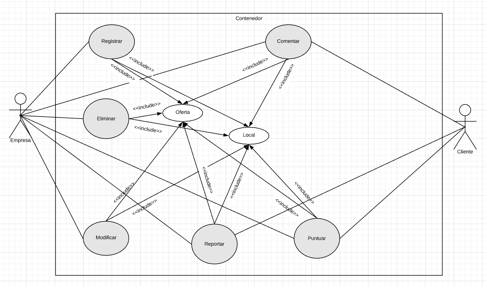
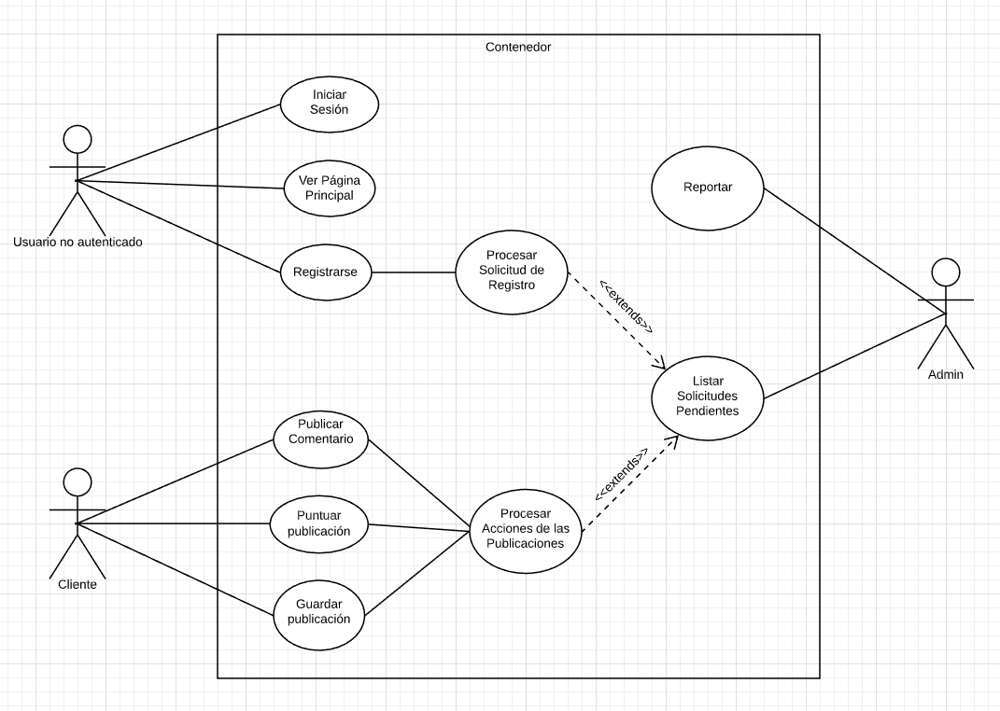

# Proyecto Aplicación Web

Proyecto de diseño de una aplicación web para la asignatura Entorno de Desarrollo curso 2019-2020

* Nombre de la aplicación: DiscoPub
* Nombre del alumno: Mario Ballestero Rodríguez
* Especificaciones:
  * Sprint: 4
  * Fecha del Sprint: 21/05/2020
  * Tareas realizadas por el alumno:
    * Diagrama de Casos de Uso 1
    * Diagrama de Casos de Uso 2
    * Ficha Tecnica 1
    * Ficha Tecnica 2
  * Tiempo empleado en cada tarea:
    * Diagrama de Casos de Uso 1:  32min
    * Diagrama de Casos de Uso 2:  27min
    * Ficha Tecnica 1:  18min
    * Ficha Tecnica 2: 17min
  * Herramientas usadas:
    * LucidChart
    * Typora
    * Git
    * Github
  * Bibliografía usada:

## Sprint 4

#### Diagrama de Casos de Uso 1

<table style="width: 100%; text-align: center;">
  <tr>
    <td style="width: 30%;">Nombre</td>
    <td style="width: 70%;">Comentar</td>
  </tr>
  <tr>
    <td style="width: 30%;">Autor</td>
    <td style="width: 70%;">Mario Ballestero</td>
  </tr>
  <tr>
    <td style="width: 30%;">Fecha</td>
    <td style="width: 70%;">17/05/2020</td>
  </tr>
  <tr>
    <td style="width: 30%;">Descripción</td>
    <td style="width: 70%;">
        Permite crear un comentario/mensaje (hilo) sobre una oferta o un local en el foro que proporcionan.
    </td>
  </tr>
  <tr>
    <td style="width: 30%;">Actores</td>
    <td style="width: 70%;">Empresa o Cliente</td>
  </tr>
  <tr>
    <td style="width: 30%;">Precondiciones</td>
    <td style="width: 70%;">
        El usuario que desee realizar un comentario deberá estar autenticado en el sistema además de no presentar ningún tipo de baneo temporal.
    </td>
  </tr>
  <tr>
    <td style="width: 30%;">Flujo Normal</td>
    <td style="width: 70%;">
        1.- El actor pulsa en el botón para redactar comentario.
         
        2.- El sistema muestra un formulario para redactar dicho comentario. Este formulario está formado por un input para un título y otro input para el cuerpo del comentario.
         
        3.- El actor introduce el título y el cuerpo del comentario.
         
        4.- El sistema valida los datos introducidos.
         
        5.- El sistema publica dicho comentario tras evaluar su validez.
         
    </td>
  </tr>
  <tr>
    <td style="width: 30%;">Flujo Alternativo</td>
    <td style="width: 70%;">
        4.A.- El sistema tras comprobar la validez de los datos introducidos, si no son correctos, se avisa al actor sobre ello y se le permite hacer modificaciones hasta que seán válidos.
    </td>
  </tr>
  <tr>
    <td style="width: 30%;">Poscondiciones</td>
    <td style="width: 70%;">
        El mensaje se ha publicado en su respectivo foro y se ha almacenado en el sistema.
    </td>
  </tr>
</table>

#### Diagrama de Casos de Uso 2

<table style="width: 100%; text-align: center;">
  <tr>
    <td style="width: 30%;">Nombre</td>
    <td style="width: 70%;">Procesar Solicitud de Registro</td>
  </tr>
  <tr>
    <td style="width: 30%;">Autor</td>
    <td style="width: 70%;">Mario Ballestero</td>
  </tr>
  <tr>
    <td style="width: 30%;">Fecha</td>
    <td style="width: 70%;">17/05/2020</td>
  </tr>
  <tr>
    <td style="width: 30%;">Descripción</td>
    <td style="width: 70%;">
        Permite analizar y validar las credenciales introducidas para el registro por un usuario no autenticado
    </td>
  </tr>
  <tr>
    <td style="width: 30%;">Actores</td>
    <td style="width: 70%;">Sistema</td>
  </tr>
  <tr>
    <td style="width: 30%;">Precondiciones</td>
    <td style="width: 70%;">
        Deben existir todas las credenciales obligarias en los inputs para que se puedan procesar.
    </td>
  </tr>
  <tr>
    <td style="width: 30%;">Flujo Normal</td>
    <td style="width: 70%;">
        1.- Llegan las credenciales introducidas por el usuario
         
        2.- El sistema mediante una serie de pautas y validaciones analiza dichas credenciales para comprobar si cumplen los requisitos
         
        3.- Se muestra un mensaje por pantalla de Usuario Registrado
         
        4.- El sistema redirecciona a dicho usuario a Iniciar Sesión
         
    </td>
  </tr>
  <tr>
    <td style="width: 30%;">Flujo Alternativo</td>
    <td style="width: 70%;">
        2.A.- El sistema tras comprobar la validez de los datos introducidos, si no son correctos, se redirecciona al usuario de nuevo a la pagina de registro proporcinandole los mensajes de error.
    </td>
  </tr>
  <tr>
    <td style="width: 30%;">Poscondiciones</td>
    <td style="width: 70%;">
        El usuario se ha registrado con éxito y ha sido guardado en el sistemas.
    </td>
  </tr>
</table>