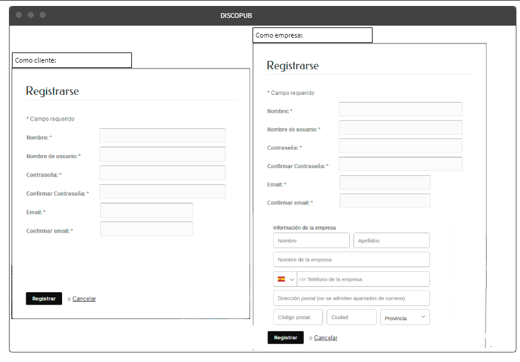
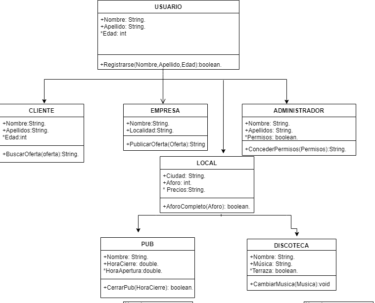
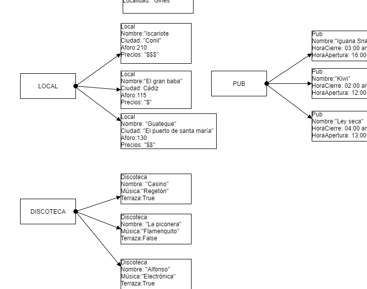
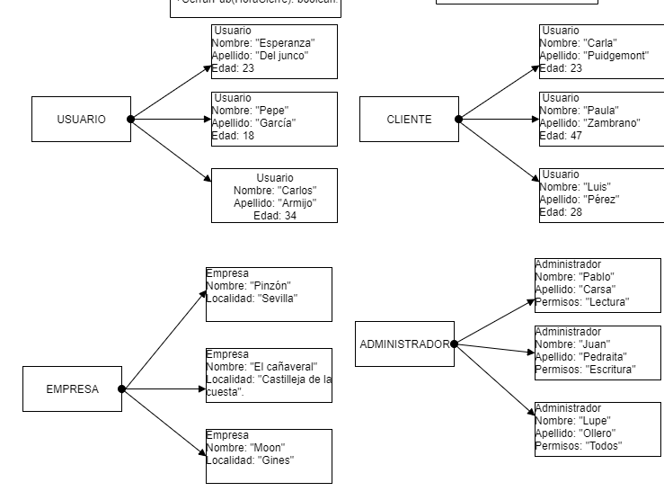

## SPRINT 2

##### Descripción mockup:

Lo que se puede observar en éste mockup es la respresentación de la app al pulsar login.
Aparecen dos opciones, Registrarse como cliente o como empresa, ya que dependiendo de lo que quieras conseguir con la aplicación obtendrás unos resultados distintos según cómo te registres.
Obviamente los datos requeridos para el registro son distintos para cada usuario.
Todo ésto siguiendo el mismo estilo elegido en común por el grupo que se ha basado en un estilo sencillo y elegante de blancos, grises y negros.

**_Mockup_**

**_Diagramas de clase_**

*Descripción diagrama de clases*:

He escogido esta estructura de clases, debido a que mi objetivo es hacer lo más personificado posible el uso de la app, que sea de uso fácil según para quien lo requiera.

He dividido el usuario en tres secciones debido a que según quién se quiera registrar en la aplicación tendrá unos u otros objetivos en mente, si eres un cliente buscas las ofertas de las empresas, y como empresas buscas clientes promocionando las mismas mediante la misma.

Por último he partido la clase local en pub y discoteca, pues aunque las dos traten el mismo tipo de ocio unas y otras se diferencian por dar tratos muy distintos a sus clientes, más tranquilos o más estruendosos, con ambientes muy distintos que pueden adecuarse más o menos a la búsqueda del cliente en el momento oportuno.

**_Diagramas de objetos_**

