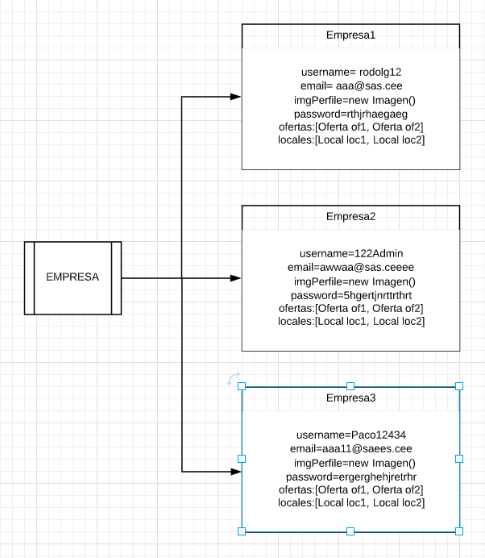
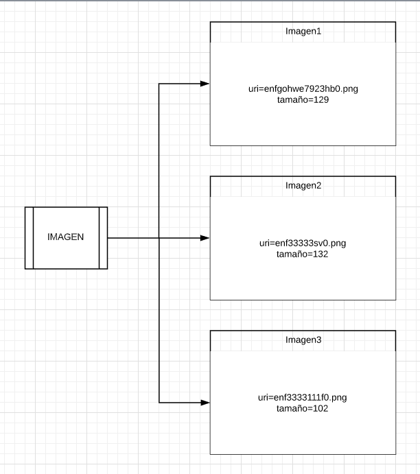

# Spring 2

##### Sobre las Herramientas usadas:

Antes que nada para el diseño del mockup he elegido la herramienta:

- [MockFlow](https://www.mockflow.com/)

Para el diseño de diagramas UML he utilizado la herramienta:

- [Lucidchart](https://www.lucidchart.com/pages/es)

Por último, para markdown he usado Typora. Y en cuanto a la búsqueda de información para su uso, no ha sido necesario ya que yo ya uso markdown desde hace un tiempo. Sin embargo, puedo facilitar uno de los enlaces donde lo aprendí (es una especie de tutorial interactivo):

- [Typora](https://typora.io/)
- [Tutorial](https://commonmark.org/help/tutorial/)

#### Mockup

##### Descripción:

​	Mockup del diseño del apartado Contactar, que muestra una carta con un formulario para rellenar con el correo, el asunto y finalmente un textarea para el mensaje de contactar con un botón para enviar.

#### Diagramas:

##### 	Diagramas de Clases:

---

Para el diagrama de clases de nuestro proyecto, he pensado crear una clase padre Usuario que extiende a los 3 tipos de usuarios Cliente, Admin y Empresa. Los clientes serán aquellos que se registren en nuestra aplicación para consultar ofertas de eventos. Por otro lado, los admin serán moderadores que dependiendo de la importancia de ellos, tendrán unos permisos u otros. Por último, las Empresas serán aquellos usuarios que se den de alta en nuestra app para ofertar o publicar eventos de sus Locales.

Por otro lado, vemos las clases Local, que nos servirá para que la empresa pueda registrar su o sus locales, luego la clase Imagen para tener un esquema en el que basarse para subir imagenes y por último la clase Oferta para que las empresas puedan registrarlas y crearlas.

##### 	Diagramas de Objetos

---

