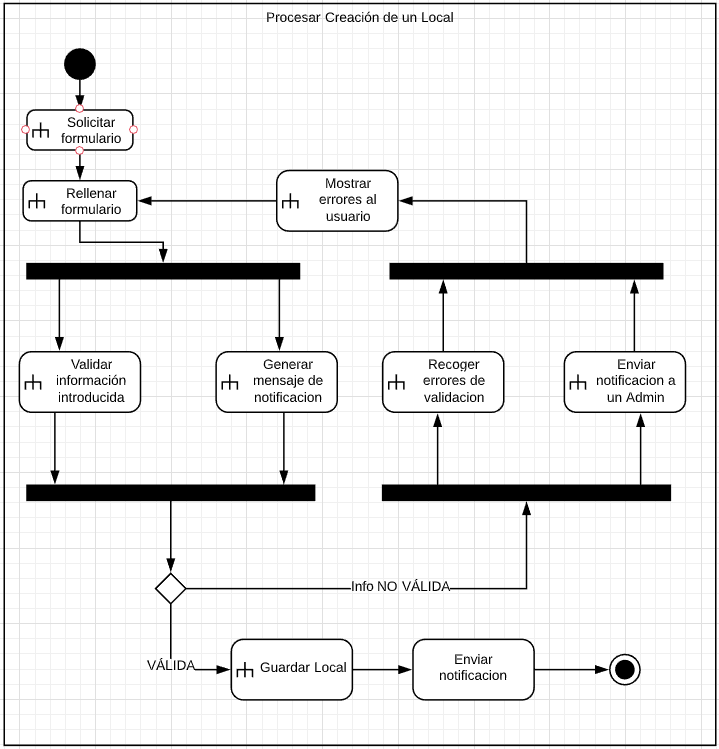

# Proyecto Aplicación Web

Proyecto de diseño de una aplicación web para la asignatura Entorno de Desarrollo curso 2019-2020

* Nombre de la aplicación: DiscoPub
* Nombre del alumno: Mario Ballestero Rodríguez
* Especificaciones:
  * Sprint: 5
  * Fecha del Sprint: 23 mayo 2020
  * Tareas realizadas por el alumno:
    * Diagrama de Actividades 1
    * Diagrama de Actividades 2
  * Tiempo empleado en cada tarea:
    * Diagrama de Actividades 1 : 22min	
    * Diagrama de Actividades 2: 36min
  * Herramientas usadas:
    * Lucidchart
    * Typora 
    * Git
    * github
  * Bibliografía usada:

## Diagramas

