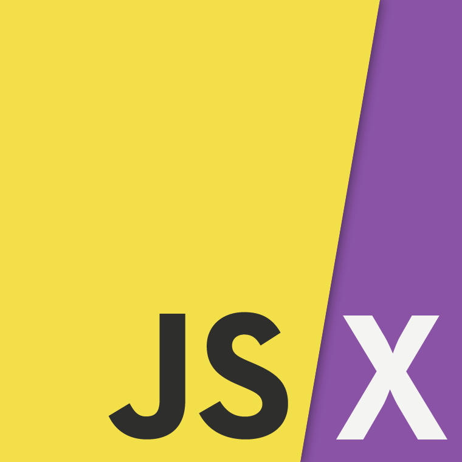

# Proyecto Aplicación Web

Proyecto de diseño de una aplicación web para la asignatura Entorno de Desarrollo curso 2019-2020

* Nombre de la aplicación: DiscoPub
* Nombre del alumno: Mario Ballestero Rodríguez
* Especificaciones:
  * Sprint: 6
  * Fecha del Sprint: 23 mayo 2020
  * Tareas realizadas por el alumno:
    * Búsqueda de Información
    * Markdown 
    * Tabla con el contenido
  * Tiempo empleado en cada tarea:
    * Búsqueda de Información: 48min
    * Markdown : 16min
    * Tabla con el contenido: 39min
  * Herramientas usadas:
    * Typora
    * Navegador Chrome
    * Git 
    * github
  * Bibliografía usada:

## Tabla

<table style="width: 100%; text-align: center;">
  <tr style="color: white; background: grey">
    <td style="width: 15%;">Partes</td>
    <td style="width: 20%;">Tecnología Elegida</td>
    <td style="width: 20%;">Logo</td>
    <td style="width: 34%;">¿Por qué?</td>
  </tr>
  <tr>
    <td style="width: 15%;">Core</td>
    <td style="width: 20%;">HTML5 / CSS3 / JS(ES6)</td>
    <td style="width: 20%;"></td>
    <td style="width: 34%;">Al elegir Bootstrap, React y NodeJs entre otros tendremos que usar estas tres tecnologías</td>
  </tr>  
  <tr>
    <td style="width: 15%;">Text Editor</td>
    <td style="width: 20%;">Visual Studio Code</td>
    <td style="width: 20%;"></td>
    <td style="width: 34%;">He elegido este editor por la comodidad que ofrece a la hora de desarrollar, además del gran número de herramientas/extensiones que facilitan muchos aspectos del desarrollo.</td>
  </tr>
  <tr>
    <td style="width: 15%;">UI Framework</td>
    <td style="width: 20%;">Bootstrap</td>
    <td style="width: 20%;"></td>
    <td style="width: 34%;">Bootstrap es un framework que nos ayuda en el diseño de nuestra web ya que hará que podamos hacerla responsive, además se implementa bastante bien con React que es el framework Js que usaremos.</td>
  </tr>
  <tr>
    <td style="width: 15%;">Responsible web design</td>
    <td style="width: 20%;">Bootstrap</td>
    <td style="width: 20%;"></td>
    <td style="width: 34%;">Como he nombrado antes bootstrap nos ofrecerá la posibilidad de que nuestro diseño web sea responsive</td>
  </tr>
  <tr>
    <td style="width: 15%;">Templating</td>
    <td style="width: 20%;">JSX</td>
    <td style="width: 20%;"></td>
    <td style="width: 34%;">En este caso no estoy muy segura, ya que nose si JSX es realmente un motor de plantillas como si lo son handlebars o ejs. Pero como en nuestro caso, usaremos React para el front, será JSX.</td>
  </tr>
  <tr>
    <td style="width: 15%;">Browser Refreshing</td>
    <td style="width: 20%;">Live Server</td>
    <td style="width: 20%;"></td>
    <td style="width: 34%;">Al usar como Text Editor Visual Studio Code, podemos usar esta herramienta para que refrescar el navegador cada vez que realicemos un cambio</td>
  </tr>
  <tr>
    <td style="width: 15%;">CSS Preprocessor</td>
    <td style="width: 20%;">Sass</td>
    <td style="width: 20%;"></td>
    <td style="width: 34%;">He elegido esta opción ya que además de reducirnos el tiempo para crear y mantener el CSS de nuestro proyecto, es una opción de procesador de CSS bastante buena para proyectos grandes.</td>
  </tr>
  <tr>
    <td style="width: 15%;">OOCSS and Style Guide</td>
    <td style="width: 20%;">Pattern Lab</td>
    <td style="width: 20%;"></td>
    <td style="width: 34%;">He elegido esta opción porque nos permite trabajar de forma eficiente haciendo uso de la metodología atomos, moleculas, organismos, plantillas y paginas</td>
  </tr>
  <tr>
    <td style="width: 15%;">Version Control</td>
    <td style="width: 20%;">Git</td>
    <td style="width: 20%;"></td>
    <td style="width: 34%;">Ya que en mi opinion es la opción más completa y que acopla mejor a nuestra perpectiva de trabajo.</td>
  </tr>
  <tr>
    <td style="width: 15%;">Package Manager</td>
    <td style="width: 20%;">npm</td>
    <td style="width: 20%;"></td>
    <td style="width: 34%;">Debido a que practicamente todo lo que queremos usar es Javascript npm es nuestra mejor opción</td>
  </tr>
  <tr>
    <td style="width: 15%;">Front-End Performance</td>
    <td style="width: 20%;">WebPagetest</td>
    <td style="width: 20%;"></td>
    <td style="width: 34%;">Ya que es una opción bastante completa y además es gratuita</td>
  </tr>
  <tr>
    <td style="width: 15%;">JS Framework</td>
    <td style="width: 20%;">React</td>
    <td style="width: 20%;"></td>
    <td style="width: 34%;">Como ya he ido diciendo React es el framework que veo más adecuado para lo que queremos conseguir en nuestra aplicación. Ya que vemos bastante cómodo estructurar el código de nuestro proyecto en componentes reutilizables</td>
  </tr>
  <tr>
    <td style="width: 15%;">JS Preprocessor</td>
    <td style="width: 20%;">Babel</td>
    <td style="width: 20%;"></td>
    <td style="width: 34%;">Debido a las elecciones de tecnologías que he ido realizando, Babel es la herramienta de procesado de código javascript más adecuada</td>
  </tr>
  <tr>
    <td style="width: 15%;">Process Automation</td>
    <td style="width: 20%;">Grunt</td>
    <td style="width: 20%;"></td>
    <td style="width: 34%;">Ya que nos facilita la opción de automatizar procesos que realizamos mucho, como compilar algún trozo de código o unidades de testing ...</td>
  </tr>
  <tr>
    <td style="width: 15%;">Code Quality</td>
    <td style="width: 20%;">ESLint</td>
    <td style="width: 20%;"></td>
    <td style="width: 34%;">He elegido esta porque ademas de que podemos tenerlo con Visual Studio Code, he estado informandome que es la mejor opción cuando trabajas con React</td>
  </tr>
  <tr>
    <td style="width: 15%;">Build Tool</td>
    <td style="width: 20%;">Webpack</td>
    <td style="width: 20%;"></td>
    <td style="width: 34%;">Porque es la mejor opción para implementar con React y Babel, herramientas elegidas anteriormente.</td>
  </tr>
  <tr>
    <td style="width: 15%;">Testing</td>
    <td style="width: 20%;"></td>
    <td style="width: 20%;"></td>
    <td style="width: 34%;">Ya que según lo que me he informado mocha nos permite testear los componentes de React</td>
  </tr>
  <tr>
    <td style="width: 15%;">Back-End</td>
    <td style="width: 20%;">Nodejs</td>
    <td style="width: 20%;"></td>
    <td style="width: 34%;">Ya que es la mejor opción para lo que queremos hacer en nuestra aplicación. Nos permitira implementar express y realizar nuestra Api rest.</td>
  </tr>
</table>

  

